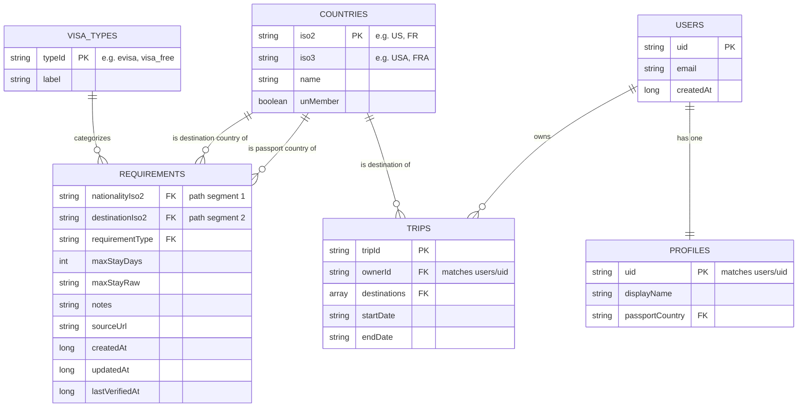

# Rootless — Firebase Realtime Database Schema

Documents the RTDB structure backing visa requirements lookup, country
reference data, and user/trip data for Rootless.

**Database:** `https://daab-fcc5c-default-rtdb.firebaseio.com`
**Region:** `us-central1`
**Related ticket:** TM08-18 — Migrate static `.db` file to Firebase

---

## Entity Relationship Diagram



> Note: RTDB has no native foreign keys — the FK markers above are
> logical relationships enforced by application code and security rules,
> not database constraints.

---

## Node Reference

### `visaTypes/{typeId}`

Static lookup table. Referenced by `requirements/*/*/requirementType`.

```json
"visaTypes": {
  "evisa":              { "label": "e-Visa" },
  "visa_free":           { "label": "Visa Free" },
  "visa_required":       { "label": "Visa Required" },
  "evisa_or_voa":        { "label": "e-Visa or Visa on Arrival" },
  "eta":                 { "label": "Electronic Travel Authorization" },
  "voa":                 { "label": "Visa on Arrival" },
  "admission_refused":   { "label": "Admission Refused" },
  "special_privilege":   { "label": "Special Privilege" },
  "unknown":             { "label": "Unspecified" }
}
```

Seeded once by `migrate_to_firebase.py`. Add new entries here if the
scraper introduces a `requirement_type` value not already listed.

### `countries/{iso2}`

One entry per ISO 3166-1 alpha-2 country code.

```json
"countries": {
  "US": { "iso3": "USA", "name": "United States", "unMember": true }
}
```

Source: `countries` table in the scraper's SQLite `.db` file.

### `requirements/{nationalityIso2}/{destinationIso2}`

The core visa lookup table. Keyed by passport country, then destination
country, so a client can fetch all requirements for one passport with a
single read: `requirements/US`.

```json
"requirements": {
  "CA": {
    "AD": {
      "requirementType": "visa_free",
      "maxStayDays": 90,
      "maxStayRaw": "90 days",
      "notes": "",
      "sourceUrl": "",
      "createdAt": 1789611086781,
      "updatedAt": 1789611086781,
      "lastVerifiedAt": 1789611086781
    }
  }
}
```

**Field notes:**
- `requirementType` — foreign key into `visaTypes`.
- `sourceUrl` — currently written as `""` (empty string) rather than
  `null`. **RTDB deletes any key written as `null`**, so an empty string
  is used as a placeholder until the scraper captures a real citation
  URL per record.
- `createdAt` / `updatedAt` / `lastVerifiedAt` — millisecond epoch
  timestamps, set by the migration script. `updatedAt` and
  `lastVerifiedAt` should be refreshed independently once the scraper
  supports incremental re-verification instead of full re-migration.

Source: `visa_requirements` table in the scraper's SQLite `.db` file.
As of the last migration, this covers 2 passport countries (384 total
rows) — Phase 1 scope, not the full 193×192 matrix.

### `users/{uid}`

Auth-linked account data only — kept minimal and separate from
`profiles` so security rules can restrict it tightly.

```json
"users": {
  "uid_123": { "email": "danielle@example.com", "createdAt": 1234567890 }
}
```

### `profiles/{uid}`

Extended per-user data, keyed by the same `uid` as `users`.

```json
"profiles": {
  "uid_123": { "displayName": "Danielle", "passportCountry": "US" }
}
```

### `trips/{tripId}`

```json
"trips": {
  "trip_abc": {
    "ownerId": "uid_123",
    "destinations": ["FR", "IT"],
    "startDate": "2026-06-01",
    "endDate": "2026-06-15"
  }
}
```

### `scraperMeta/lastMigration`

Written automatically by `migrate_to_firebase.py` on every run — not
app-facing, used for debugging pipeline runs.

```json
"scraperMeta": {
  "lastMigration": {
    "timestamp": 1789611086781,
    "sourceFile": "visa_data.db",
    "countriesWritten": 193,
    "requirementsWritten": 384
  }
}
```

---

## Migration & Verification Scripts

| Script | Purpose |
|---|---|
| `migrate_to_firebase.py` | Reads the scraper's SQLite `.db` and writes `visaTypes`, `countries`, `requirements` to RTDB in batched, idempotent multi-path updates. Also scaffolds `users`/`profiles`. |
| `verify_migration.py` | Confirms top-level nodes are populated, performs a live insert/read/delete round-trip, and spot-checks one requirement record for required audit fields. |

```bash
pip install -r requirements.txt

python migrate_to_firebase.py \
  --db visa_data.db \
  --cred serviceAccountKey.json \
  --db-url https://daab-fcc5c-default-rtdb.firebaseio.com

python verify_migration.py \
  --cred serviceAccountKey.json \
  --db-url https://daab-fcc5c-default-rtdb.firebaseio.com
```

Both scripts are safe to re-run against a fresh or existing database —
writes are keyed by ISO codes rather than auto-generated IDs, so re-runs
overwrite in place instead of duplicating data.

**Never commit `serviceAccountKey.json`** — it grants full admin access
bypassing all security rules. Add it to `.gitignore`.

---

## Security Rules Summary

Public read-only reference data (`visaTypes`, `countries`, `requirements`)
is open to all reads and closed to all client writes — writes happen only
through the Admin SDK migration script. `users`, `profiles`, and `trips`
are scoped so each user can only read/write their own records.

```json
{
  "rules": {
    "visaTypes":  { ".read": true, ".write": false },
    "countries":  { ".read": true, ".write": false },
    "requirements": { ".read": true, ".write": false },
    "scraperMeta": { ".read": false, ".write": false },
    "users": {
      "$uid": {
        ".read": "$uid === auth.uid",
        ".write": "$uid === auth.uid"
      }
    },
    "profiles": {
      "$uid": {
        ".read": "$uid === auth.uid",
        ".write": "$uid === auth.uid"
      }
    },
    "trips": {
      "$tripId": {
        ".read": "data.child('ownerId').val() === auth.uid",
        ".write": "data.child('ownerId').val() === auth.uid || !data.exists()"
      }
    }
  }
}
```

## Known Limitations / Next Steps

- `requirements` currently covers only 2 passport countries (Phase 1
  scope). Full matrix expansion is a scraper pipeline task, not a schema
  change.
- `sourceUrl` is placeholder (`""`) for all existing records until the
  scraper captures per-record citations.
- RTDB has no compound querying — if `trips` ever needs filtering across
  multiple fields (e.g. date range + destination), that's a signal to
  revisit the Firestore-vs-RTDB decision for that specific node, not the
  whole database.
